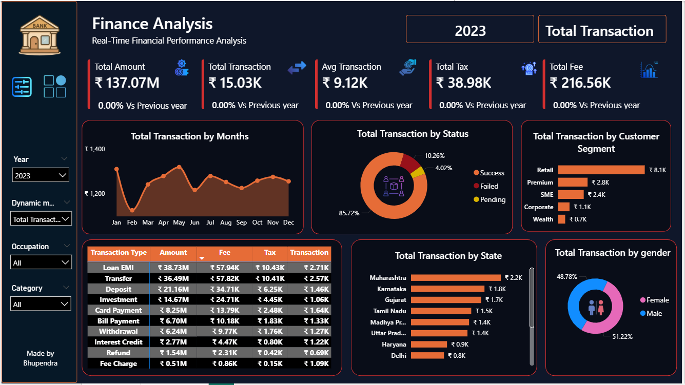

# Finance Analysis Dashboard | Power BI

## Table of Contents

- [Project Overview](#project-overview)
- [Dataset Used](#dataset-used)
- [Data Model](#data-model)
- [Dashboard Overview](#dashboard-overview)
  - [Overview Dashboard](#page-1-overview-dashboard)
  - [Transaction Details Dashboard](#page-2-transaction-details-dashboard)
- [Power BI Features Used](#power-bi-features-used)
- [Key Insights](#key-insights)
- [Tools & Technologies](#tools--technologies)
- [Repository Structure](#repository-structure)
- [Author](#author)

---

# Finance Analysis Dashboard | Power BI

## Project Overview

This project is an interactive **Finance Analysis Dashboard** developed in **Power BI** to analyze financial transactions, customer behavior, and business performance metrics. The dashboard helps users monitor key financial indicators, identify trends, and gain actionable insights through interactive visualizations.

---

## Dataset Used

The dashboard is built using the following datasets:

### 1. finance_transaction.csv
Contains transaction-level information including:
- Transaction Amount
- Transaction Type
- Transaction Status
- Tax
- Fee
- Transaction Date
- Customer ID

### 2. customer.csv
Contains customer-related information including:
- Customer ID
- Gender
- Occupation
- State
- Customer Segment

### 3. calendar_table
Custom calendar table created for:
- Time Series Analysis
- Year-wise Analysis
- Month-wise Analysis
- Date Intelligence Calculations

---

## Data Model

The dashboard follows a simple star schema:

- `finance_transaction.csv` ↔ `customer.csv` using Customer ID
- `finance_transaction.csv` ↔ `calendar_table` using Transaction Date

This structure enables efficient filtering and accurate reporting across multiple dimensions.

---

# Dashboard Overview

## Page 1: Overview Dashboard

**File:** `Dashboard_Main.png`

The Overview page provides a high-level summary of financial performance and key business metrics.

### Key Features

- Total Amount KPI
- Total Transactions KPI
- Average Transaction KPI
- Total Tax KPI
- Total Fee KPI
- Monthly Transaction Trend Analysis
- Transaction Status Distribution
- Customer Segment Analysis
- State-wise Transaction Analysis
- Gender-wise Analysis
- Dynamic Measure Selection
- Interactive Slicers and Filters

### Dashboard Preview



---

## Page 2: Transaction Details Dashboard

**File:** `Dashboard_Transaction_Details.png`

The Transaction Details page provides detailed transaction-level insights for deeper analysis.

### Key Features

- Detailed Transaction Records
- Transaction Type Analysis
- Customer Information Analysis
- Advanced Filtering Options
- Financial Metrics Breakdown
- Interactive Transaction Exploration

### Dashboard Preview


---

## Power BI Features Used

### Data Preparation
- Power Query
- Data Cleaning
- Data Transformation

### Data Modeling
- Relationships
- Star Schema Design
- Calendar Table Integration

### DAX Measures
- Total Amount
- Total Transactions
- Average Transaction Value
- Total Tax
- Total Fee
- Dynamic KPI Measures

### Visualizations
- KPI Cards
- Line Charts
- Donut Charts
- Bar Charts
- Tables
- Slicers

---

## Key Insights

- Analyzed transaction trends across different months and years.
- Identified customer segments contributing the highest transaction volume.
- Evaluated transaction status distribution.
- Compared transaction performance across different states.
- Analyzed tax and fee contributions to total transaction value.

---

## Tools & Technologies

- Power BI Desktop
- Power Query
- DAX
- Data Modeling
- CSV Files

---

## Repository Structure

```text
Finance-Analysis-Dashboard/
│
├── Finance Analysis Dashboard.pbix
├── finance_transaction.csv
├── customer.csv
├── Dashboard_Main.png
├── Dashboard_Transaction_Details.png
├── README.md
└── assets/
```

---

## Author

**Bhupendra Sethiya**

Data Analyst

GitHub: https://github.com/bhupendrasethiya007
